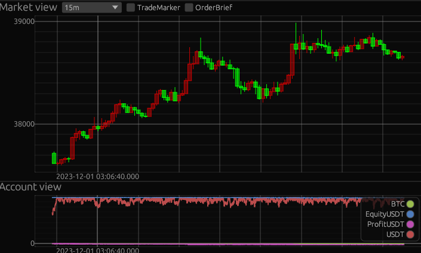

# Maker Simulator
An *experimental* trading bot framework in Rust with a pub-sub architecture, focusing on market maker strategy.

* Backtesting by tick-level data and maker order
* Same code for backtesting and real trading
* Performant

# Usage
1.Download historical bookticker and trade data from Binance \
`cargo r --bin binance_data_download --release -- -a 20231201 -b 20231201 download`

2.Run simulation on history data \
`cargo r --bin sim --release -- -d 2023-12-01 --vis`

# Design Brief
We used a pub-sub architecture. \
The core concept are `Module`, `Topic` and `Engine`.

### `Module` and `Topic`
Each module can publish and subscribe messages from topics. \
Interface of module can be found in `crates\upstair_type\src\module.rs`

We currently have these modules to support minimal strategy backtesting: \
`crates\binance_republisher` for republish bookticker and trade data \
`crates\market_agent` for simulating order execution in exchange \
`crates\stepper` for core market maker strategy code (yet still very simple) \
`crates\vis` for plotting the market trends and pnl curve

### `Engine`
It will schedule module to run at correct order. \
It also manages the communication between modules. 
